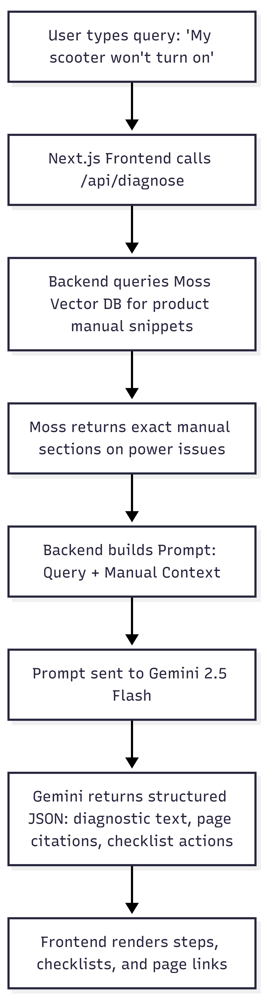

# Mantis - AI-Powered Support for Every Product You Own

Mantis is an intelligent support and diagnostics portal built for a 24-hour hackathon. It allows companies to list their products and upload manuals, and gives users access to an interactive, technician-style AI Diagnostic Assistant to troubleshoot and repair equipment systematically.

## 🛠️ Diagnostics Architecture Flow



---

## 💻 Tech Stack & Versions

* **Frontend:** Next.js `16.2.9` (App Router, TypeScript, React 19)
* **Styling:** Tailwind CSS `v4.3` (CSS-first configuration)
* **Backend:** Elysia `1.4.28` (running on Bun)
* **Runtime & Package Manager:** Bun `v1.3.14`

---

## 🎨 Design System

Mantis uses a modern, light tech-green aesthetic:
* **Background:** Soft Slate (`#f8fafc`)
* **Surfaces:** True White (`#ffffff`) with subtle rounded borders (`rounded-2xl` / `rounded-3xl`)
* **Accent Green:** Kelly Green (`#16a34a`) / Hover (`#15803d`)
* **Typography:** `Plus Jakarta Sans` for headers, `Manrope` for body and chat.

---

## 📂 Project Structure

```
Mantis/
├── backend/               # Elysia Backend (Bun runtime)
│   ├── src/
│   │   └── index.ts       # Server entry point with CORS and mock APIs (Port 8000)
│   └── package.json
│
├── frontend/              # Next.js Frontend
│   ├── public/            # Static assets (logos, product photography)
│   ├── src/
│   │   ├── app/
│   │   │   ├── page.tsx          # Main Support Dashboard page
│   │   │   ├── layout.tsx        # Google Fonts injection & Navbar shell
│   │   │   ├── globals.css       # Tailwind imports & theme variables
│   │   │   ├── diagnostics/      # Diagnostics chat view
│   │   │   ├── dashboard/        # Manual upload page
│   │   │   └── products/         # Marketplace catalog & details
│   │   └── components/
│   │       ├── Navbar.tsx        # Header Navigation bar
│   │       └── DiagnosticAssistant.tsx # Active chat technician widget
│   └── package.json
│
└── docs/
    └── AGENTS.md          # Workspace rules & guidelines for AI coding agents
```

---

## 🚀 Getting Started

Ensure you have [Bun](https://bun.sh) installed.

### 1. Run the Backend API
Navigate to the `backend` folder, install dependencies, and start the development server:
```bash
cd backend
bun install
bun run dev
```
The Elysia API will boot up on **`http://localhost:8000`**.

### 2. Run the Next.js Frontend
Navigate to the `frontend` folder, install dependencies, and start the Next.js dev server:
```bash
cd frontend
bun install
bun dev
```
The React application will boot up on **`http://localhost:3000`**.

### 3. Open in Browser
Open your browser and navigate to **`http://localhost:3000`** to view the application.

---

## 🤖 AI Agent Integration
This project is fully context-engineered for AI coding assistants. Standard agent instructions, behavior guidelines (acting as a Teacher/Architect), and design token specifications are stored inside [docs/AGENTS.md](file:///c:/projects/Mantis/docs/AGENTS.md).
